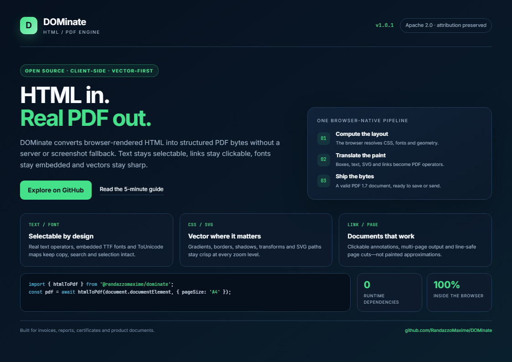
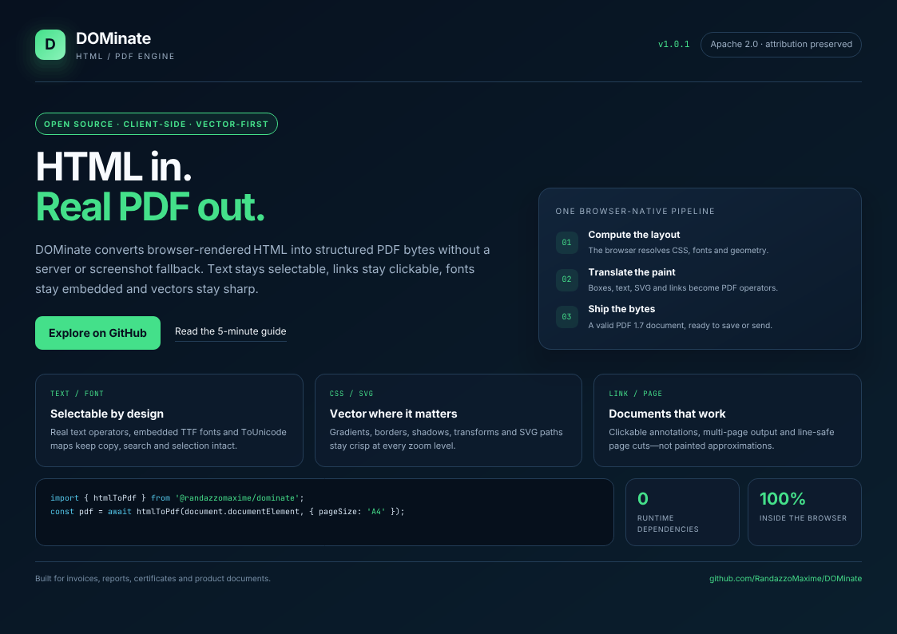

# DOMinate

[](https://github.com/RandazzoMaxime/DOMinate/releases)
[](https://github.com/RandazzoMaxime/DOMinate/actions/workflows/ci.yml)
[](LICENSE)
[](package.json)

**Vector-first HTML → PDF, entirely in the browser.** DOMinate turns an HTML
document into PDF bytes without a server, a headless browser at runtime, a
third-party PDF writer, or a canvas screenshot.

The result keeps the things that make a PDF useful: selectable/searchable text,
subsetted embedded fonts, clickable links, vector paths, gradients, borders and
SVG geometry.

## Why DOMinate exists

This project started from a simple frustration: browser-side JavaScript PDF
libraries often produced output that looked approximate, while screenshot-based
solutions could look acceptable at one zoom level but lost text selection,
search, accessibility and crisp vector rendering.

DOMinate takes a different route. It asks the host browser for the computed
layout, then writes the PDF objects and drawing operators itself. The browser
handles CSS layout; DOMinate handles the PDF.

## HTML vs generated PDF

This one-page project overview is [`docs/showcase.html`](docs/showcase.html),
rendered at 1123 × 794 CSS pixels. DOMinate converts that exact HTML to PDF; the
PDF is rasterized back to 96 DPI only for the visual comparison below. The actual
PDF remains a structured vector document with selectable text and clickable links.

| HTML in Chromium | PDF generated by DOMinate |
|:---:|:---:|
|  |  |

### Reproducible benchmark

Measured on Windows x64, Node 24.12.0 and Chromium 147.0.7727.15. The document
and fonts were loaded before timing; results show one cold call and seven
steady-state generation calls. Lower pixel difference is better.

| Cold | Warm median | Warm p95 | Difference vs HTML | PDF size |
|---:|---:|---:|---:|---:|
| 315.6 ms | 275.9 ms | 301.3 ms | 1.319% | 302.2 KiB |

Run the exact benchmark yourself:

```bash
npm ci
npx playwright install chromium
npm run benchmark
```

Machine-readable results live in [`benchmark/results.json`](benchmark/results.json).
Numbers are a snapshot, not a universal promise; test with your own templates.

## Features

- Selectable and searchable text using real PDF text operators.
- TTF/OTF parsing and lazy font embedding as `Type0` / `CIDFontType2`, with
  `ToUnicode` maps.
- Clickable URI and mail links using PDF link annotations.
- Browser-computed block, flex, grid, table, float, columns and positioned layout.
- Multi-page output, automatic line-safe cuts and explicit page breaks.
- Solid, linear and radial backgrounds; rounded and styled borders; shadows,
  outlines, clipping, opacity and 2D transforms.
- JPEG passthrough, a from-scratch PNG decoder, background images and `object-fit`.
- SVG paths, shapes, transforms, strokes, joins, caps and dash patterns.
- Pseudo-elements, list markers, form values and common text decorations.

## Quick start

Try the repository locally:

```bash
git clone https://github.com/RandazzoMaxime/DOMinate.git
cd DOMinate
npm install
npx playwright install chromium   # development and tests only
npm run demo
```

Open <http://localhost:5173> and drop an HTML file into the converter.

To consume the GitHub release before an npm package is published:

```bash
npm install github:RandazzoMaxime/DOMinate#v1.0.1
```

The current release loads bundled fonts from `/assets/fonts`. Copy the package's
`assets` directory into your application's public root, then call the API:

```js
import { htmlToPdf } from '@randazzomaxime/dominate';

const pdf = await htmlToPdf(document.querySelector('#invoice'), {
  pageSize: 'A4',
  orientation: 'portrait',
});

const url = URL.createObjectURL(new Blob([pdf], { type: 'application/pdf' }));
const link = Object.assign(document.createElement('a'), {
  href: url,
  download: 'invoice.pdf',
});
link.click();
setTimeout(() => URL.revokeObjectURL(url), 1000);
```

See [USAGE.md](USAGE.md) for API details, pagination and the support matrix.

## Architecture

```text
HTML string / HTMLElement
        │
        ▼
hidden iframe + browser layout engine
        │  computed boxes, text ranges, paint order
        ▼
DOMinate painter
        │  PDF text, paths, shadings, images, annotations
        ▼
Uint8Array containing a PDF 1.7 document
```

Everything under `src/` is dependency-free. Playwright, PDF.js, pixelmatch and
canvas packages are development-only tools used to generate references, audit
PDF semantics and measure visual differences.

## Testing

```bash
npm test        # 91 semantic/structural checks across 13 public fixtures
npm run loop    # HTML render → PDF → 96 DPI raster → pixel diff + audits
npm run benchmark
```

The 13-fixture suite covers production layouts plus adversarial CSS, text, SVG,
images, tables, transforms, pseudo-elements and pagination. The current aggregate
visual difference is 0.643%; all link, text extraction and font-embedding gates
pass. Remaining differences are primarily glyph rasterization/anti-aliasing,
not missing document structure.

## Current limits

- WOFF2 decoding and variable-font axis instancing.
- BiDi/RTL shaping and complex scripts such as Arabic and Indic.
- CSS filters, backdrop filters, 3D transforms and CSS counters in pseudo-content.
- Full accessibility tagging / PDF-UA conformance.

DOMinate is a focused v1, not a claim to implement every browser/PDF edge case.
Please open an issue with a reduced HTML fixture when you find one.

## Contributing

Ideas, bug reports, fixtures, documentation and focused pull requests are welcome.
Start with [CONTRIBUTING.md](CONTRIBUTING.md), read the
[Code of Conduct](CODE_OF_CONDUCT.md), and use [GitHub Discussions](https://github.com/RandazzoMaxime/DOMinate/discussions)
for design proposals.

Good first contributions include:

- adding a minimal regression fixture for an unsupported CSS construct;
- improving font/script coverage;
- reducing a measured pixel-diff region without breaking PDF semantics;
- improving bundler integration and the public API.

## License

DOMinate's source code is released under the [Apache License 2.0](LICENSE). Reuse
is open, including commercially, provided the license and attribution in
[`NOTICE`](NOTICE) are preserved as required by the license. Bundled fonts and
icons retain their own licenses; see [THIRD_PARTY_NOTICES.md](THIRD_PARTY_NOTICES.md).
